# Goofie Games for kids
Goofie Games website is a landing page for parents and children looking for recommended FUN computer games for kids aged 6 - 12.

Users of this website will be able to find a list of FUN computer games, ones to buy and ones for free. There will be a link to a trailer for each game, followed by an image of the game and a summary of the game. Kids will be able to sign up as Goofie Game club members and make their own recomendations. There will be a weekly 'recommended by' section where one of our members recommendation will be displayed.

## Features (PAGE 1 - HOME PAGE)  
Laptop view

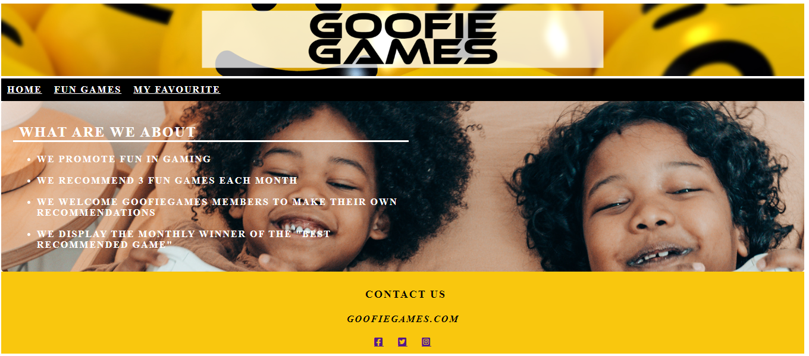  
Mobile view

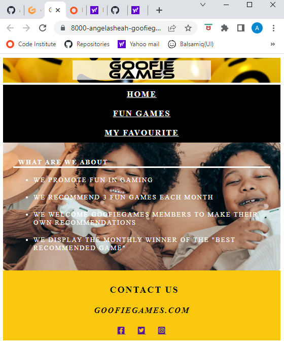  

### The Header

#### Banner
- This banner was created in Adobe Express. This banner is displayed on all 3 pages of my site.

#### Navigation bar
- The navigation bar consists of three links on the left: Home, Fun Games and My Favourite. The navigation bar is fully responsive and allows for easy navigation. The navigation bar links are displayed vertically on mobile view.

### The Body
- The background for my Home Page is made up of an image I sourced from pexel.com
- A Level 1 heading -  "What Are We About?"
- An unordered list, listing the 4 objectives of this website.

### The Footer
- A 'Contact Us' text heading
- A contact email link for my site
- Social media links to Facebook, Twitter and Instagram (fontawesome icons)

## FEATURES (PAGE 2 - FUN GAMES PAGE)
Laptop View

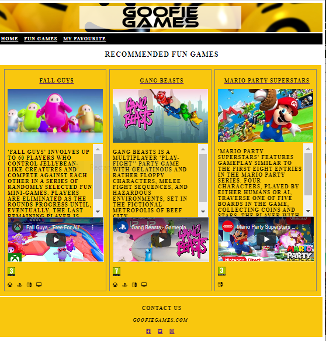  
    
Mobile View

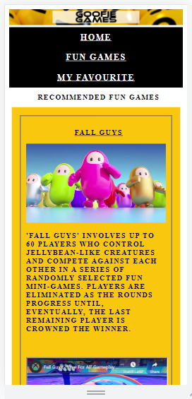

The purpose of this page is to introduce the user to an age-appropriate FUN game via:
The elements on this page are:
- Game image
- Game description
- Game trailer (Embedded video)
- PEGI age rating icon
- Device icons (representing on which devices the game can play)- also Fontawesome icons. 

### FEATURES (PAGE 3 - MY FAVOURITE PAGE)  

Laptop View 

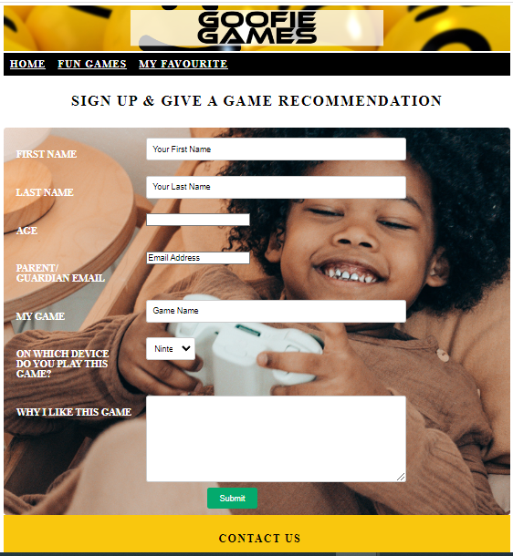  
  
Mobile View  

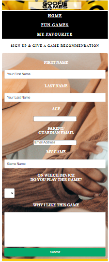

- The 'My Favourites Page' also displays the hero image from the Home Page as its background.  This page also displays a form to be completed by a child so he/she can become members of the Goofie Games club.
- The form collects:
    - the child's name (first name, last name) & age
    - parent/guardians email address
    - childs game recommendation
    - the device on which he/she plays this game
    - A 'Why I like this game' textarea.
- The form is valuable to the child because the child can give his/her game recommendation(s), which will be saved on the site and can be choosen to be displayed on the Home Page on a particular week.

### Features Left to Implement
The 'Best Recommended Game Winner' section, where a members' game recommendation (after having being vetted) will be randomly selected to be displayed on the Home Page of my site.  

## Design 
### Colour Scheme
Background colour for Page 2 and footer is a mustard shade, #f9c70e;
Navigation bar is black and changes to white on hover.

### Typography  
Monospace google font imported via CSS file (style_flex.css)

### Imagery  
Header banner & Logo - created using Adobe Express.
Hero image sourced from - [Pexel](https://www.pexels.com/royalty-free-images/)  
### Wireframes
Created using [Figma](https://www.figma.com/)  

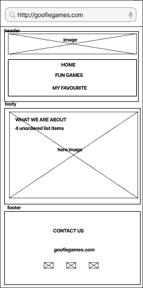
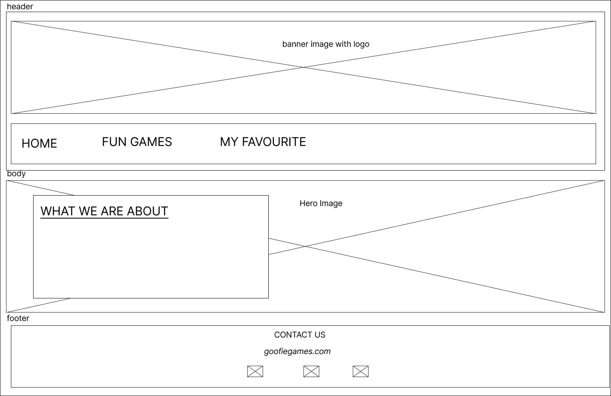  
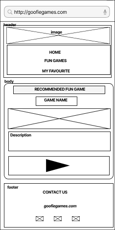  
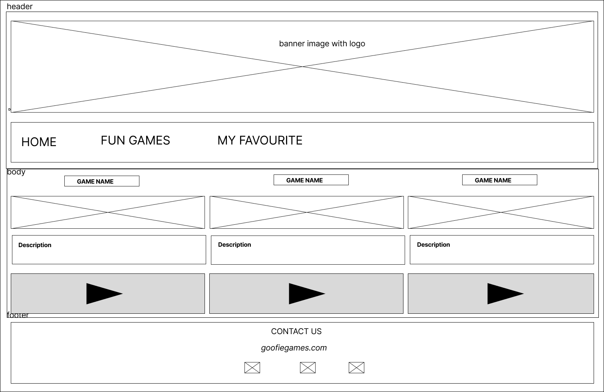  
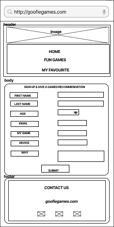
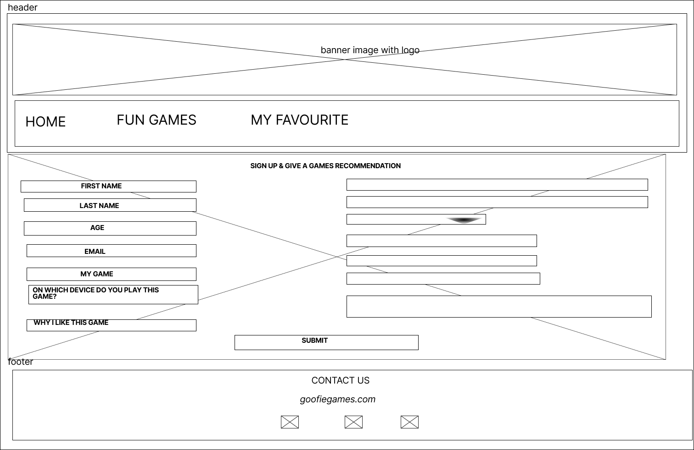

## Technology Used
- HTML
- CSS
- [Fontawesome](https://fontawesome.com/) - for xbox, playstation, nintendo, PC icons.
- [Abobe Express](https://www.adobe.com/express/) - to create my header banner.
- [Figma](https://www.figma.com/) - to create my Wireframes  
- [Pexel](https://www.pexels.com/royalty-free-images/) - to source my hero image.  
- [Google Fonts](https://fonts.google.com/)- used to import the Monospace font-family.  

## Testing
- Goofie Games site worked in different browsers: Chrome, Firefox, Safari.
- My website is fully responsive (by applying media queries in the CSS)
- My website is easy to navigate.
- All the links (internal & external) have been tested and work.
- The form, on page 3 of my site, passed validation tests.

### Validator Testing
#### HTML Testing (via W3C Validator)
- Homepage & Fun Games Page (No errors/warnings)

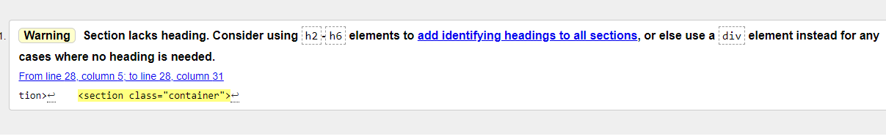

- My Favourite Page

#### CSS (Jigsaw Validator)

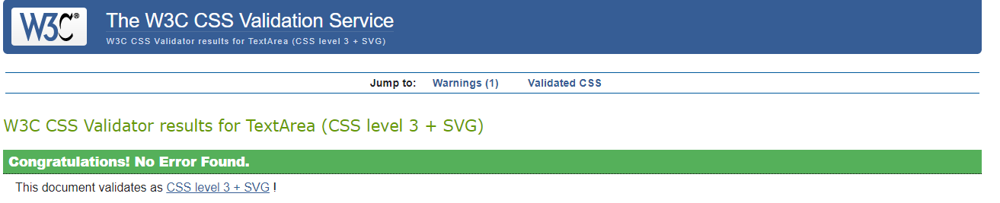

#### Accessibility (Lighthouse in DevTools)

- Homepage

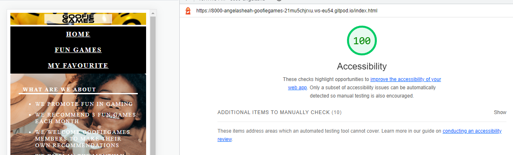  

- Fun Games Page 
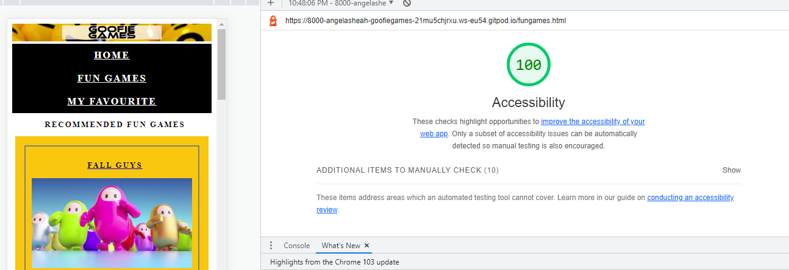

- My Favourite Page  
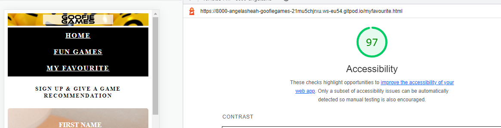

## Deployment
- Deployed to GitHub pages ....

## Credits

[w3schools](https://www.w3schools.com/)  

[stackoverflow](https://stackoverflow.com/)  
